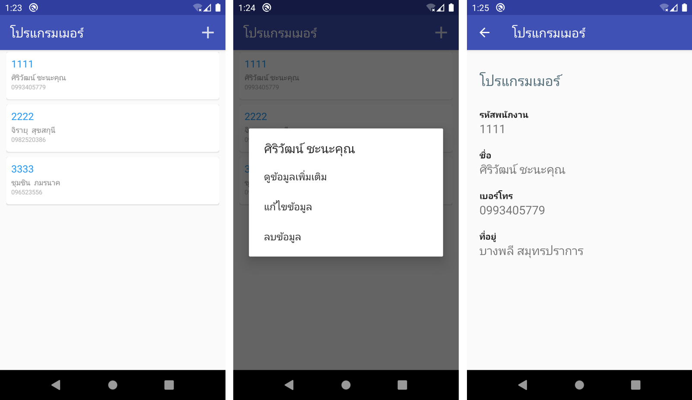
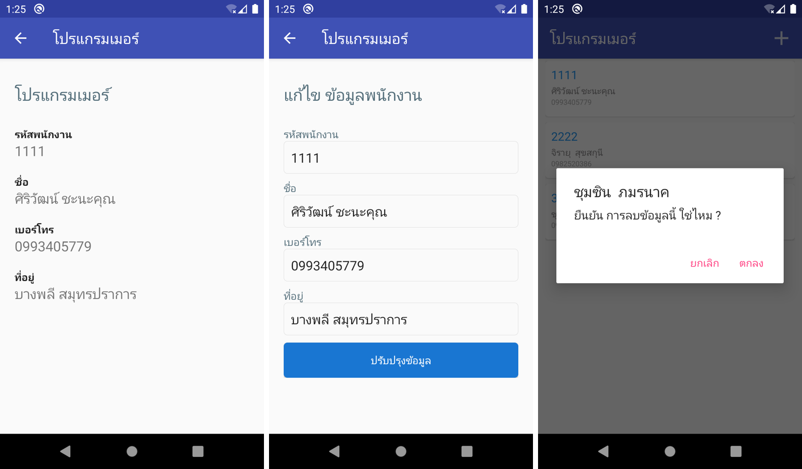

# Android CRUD API

ตัวอย่าง Android App CRUD (เพิ่ม อ่าน แก้ไข ลบ) 

ใช้ ดาต้าเบส (MySql Database)  
ใช้  Volley Library สำหรับติดต่อ API
ใช้ รูปแบบมาตรฐาน  JSON ในการโอนถ่ายข้อมูล้างโดย
ใช้ PHP สำหรับสร้าง API 
รองรับ เครือข่าย Network. 
รองรับภาษาไทย แบบ UTF8
สร้างโดย Android Studio 4.1.1

# จัดทำโดย
โปรแกรมเมอร์ ศิริวัฒน์ ชะนะคุณ
เว็บไซด์ www.siriwat.info

# การติดตั้ง

* พร้อม ไฟล์ SQL ตัวอย่าง Import ใช้ได้เลย
* คัดลอกโฟล์เดอร์ android_API ไปรันใน PHP Webserver
* แก้ไขการเชื่อต่อฐานข้อมูล ที่ connection.php
* แก้ไขการเชื่อมต่อ URL ที่ไฟล์ Constant.jav 

# ตัวอย่างหน้าจอ

